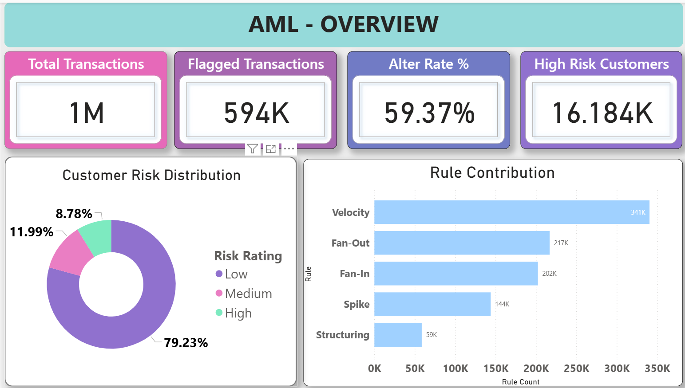
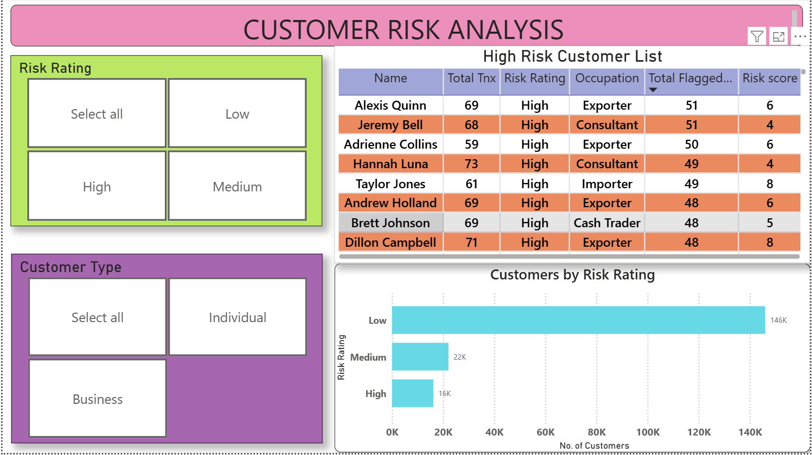

**AML Transaction Monitoring Dashboard**

**Overview**

This project focuses on analyzing large-scale transaction data to identify suspicious behavioral patterns and generate customer-level risk insights. The workflow covers data cleaning, feature engineering, SQL-based analysis, and building an investigation-focused dashboard in Power BI.

## Dashboard Preview

**Problem Statement**

Financial institutions need efficient ways to monitor transaction activity and prioritize customers who may require investigation. Raw transaction logs alone do not provide actionable insights, so this project transforms transaction data into behavior-based risk metrics and visual dashboards.

**Tools \& Technologie**s

Python (Pandas, NumPy, Jupyter Notebook) – data cleaning, sampling, and feature engineering

SQL / MySQL – analytical querying and business-focused questions

Power BI – dashboard creation and visualization

**Dataset**

Large AML transaction dataset (~10M rows initially)  from Kaggle 

Reduced to ~1M rows using risk-preserving sampling

**Key fields include:**

transaction timestamp,
sender \& receiver accounts,
amount,
payment type,
laundering indicator (used only for validation).

**Approach**

**1.Data Preparation (Python)**

* Cleaned and standardized transaction data

* Created timestamp fields

* Performed intelligent sampling while preserving risky behavior

**2. Engineered behavioral metrics:**

* transaction velocity
* near-threshold structuring
* behavioral spikes
* fan-in / fan-out network activity

**3.  Risk Modeling**

* Built rule-based transaction risk scores
* Aggregated metrics to customer level
* Generated customer risk categories (Low / Medium / High)

**4. SQL Analysis**

* Answered key AML questions such as:
* identifying high-risk customers
* alert rate analysis
* rule contribution comparison
* customer risk distribution

**5. Dashboard Development (Power BI)**

* Created a monitoring dashboard with:
* AML overview KPIs
* rule contribution visualization
* risk distribution view
* high-risk customer investigation table

**6. Dashboard Highlights**

* Total transaction volume \& alert rate KPIs
* Customer risk prioritization view

**7. Key Outcomes:**

* Converted raw transaction data into explainable risk insights
* Designed a structured fact–dimension model for analytics
* Built a clean AML monitoring dashboard aligned with investigation workflows 

**8. Future Improvements**

* Network graph visualization
* Time-series anomaly monitoring
* Rule tuning and performance evaluation
